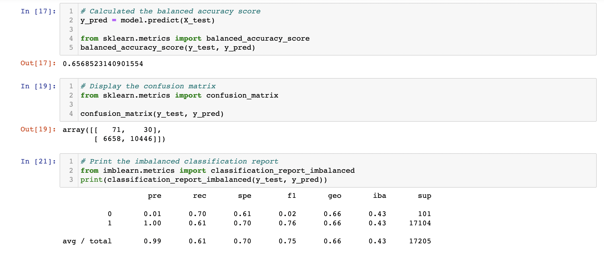
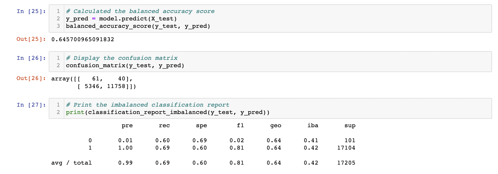
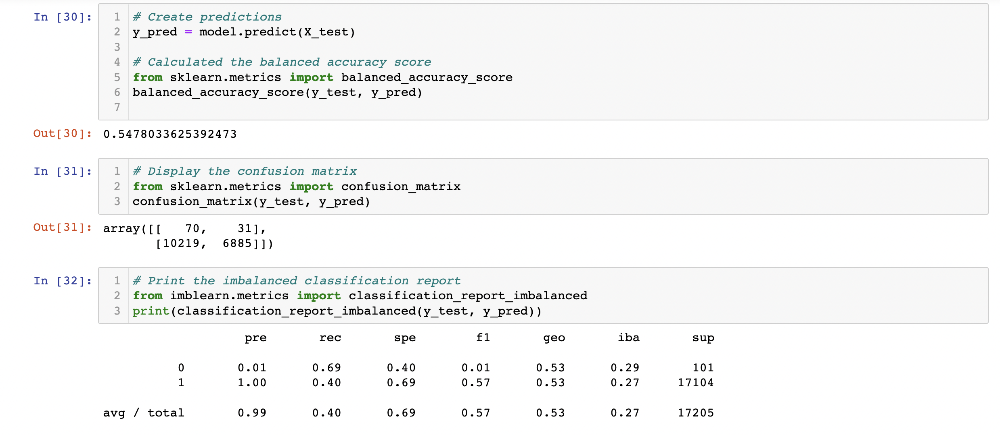
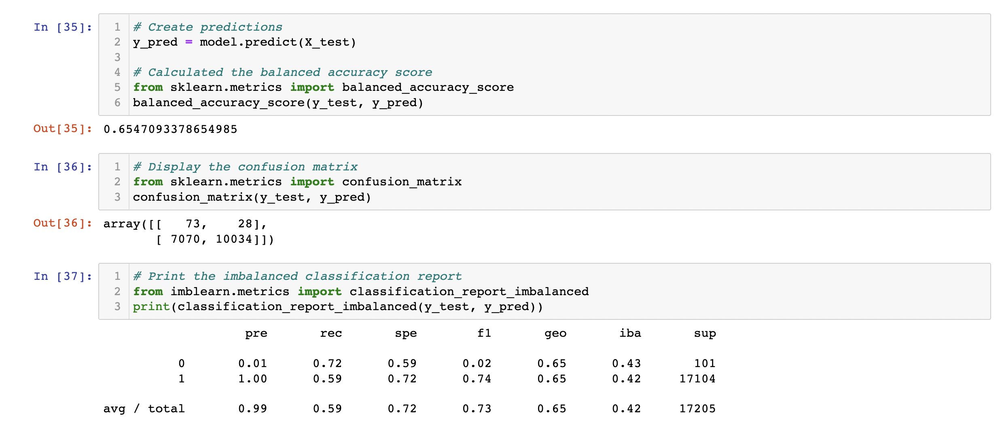
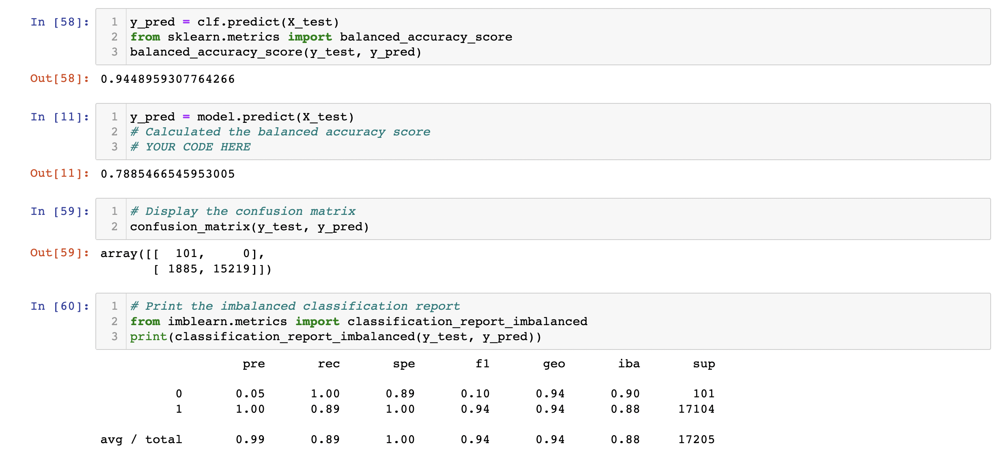
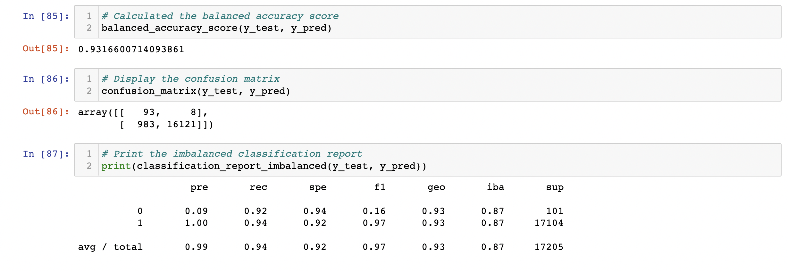

# Credit_Risk_Analysis

## Overview
The goal of this project was to compare the effectiveness of machine learning models on identifying credit risk. This dataset was unbalanced as there are far more good loans than risky loans. Thus, the approach taken here focused on training and evaluating models with unbalanced classes. More specifically, I compared oversampling models such as RandomOverSampler and SMOTE, as well as undersampling models such as ClusterCentroids. In addition, I also used the under-over sampling model SMOTEEN. Finally, I also used BalancedRandomForestClassifier and EasyEnsembleClassifier, which are algorithims that focus on reducing bias. 

## Resources
This Jupyter Notebook contains the code where resampling techniques (RandomOverSampler, SMOTE, ClusterCentroids, and SMOTEENN) were performed on the credit risk data.

[Resampling Techniques Used on Credit Risk Data](credit_risk_resampling.ipynb)

This Jupyter Notebook contains the code where ensemble techniques (BalancedRandomForestClassifier and EasyEnsembleClassifier) were performed on the credit risk data.

[Ensemble Techniques Used on Credit Risk Data](credit_risk_ensemble.ipynb)

This link is for the credit risk data analyzed.

[Credit Risk Data](LoanStats_2019Q1.csv.zip)

## Results
Please note that the values for "Low Risk" loans are given a label of 1 and "High Risk" loans are given a label of 0. In addition, for each algorithm listed below, the models were with random_state=1.

**RandomOverSampler**
In the image below, the data and metrics for the RandomOverSampler algorithm are shown. The accuracy score was 65.7%. While the F1 score for detecting low risk loans was fairly high (0.76) the score for detecting high risk loans was extremely low (0.02), which is likely due to the low precision (0.01). 

 

**SMOTE**
In the image below, the data and metrics for the SMOTE algorithm are shown. The accuracy score was 64.6%. The F1 score for detecting low risk loans was a bit higher (0.81) relative to RandomOverSampler (0.57). There was no difference in the F1 score for detecting high risk loans between these two algorithms. 

**ClusterCentroids**
In the image below, the data and metrics for the ClusterCentroids algorithm are shown. While RandomOverSampler and SMOTE are oversampling techniques, ClusterCentroids is an undersampling based algorithm. The accuracy score was 54.8%. The F1 score for detecting low risk loans was lower than RandomOverSampler and SMOTE (0.57). There was no difference in the F1 score for detecting high risk loans between these two algorithms. 

**SMOTEENN**
The image below, shows the metrics for the combination sampling method SMOTEENN. The accuracy score was 65.5%. The F1 score for detecting low risk loans was similar (0.74) to that of RandomOverSampling and SMOTE.  There was a very slight improvement in the F1 score for detecting high risk loans (0.02) compared to the other algorithms mentioned above (0.01). 

**BalancedRandomForestClassifier**
The image below, shows the metrics for the combination sampling method BalancedRandomForestClassifier. The accuracy score was 78.9%. The F1 score for detecting low risk loans was quite high (0.91), indicating this algorithm is a good predictor of low risk loans. There was also a very slight improvement in the F1 score for detecting high risk loans (0.10) relative to the algorithms listed above.

**EasyEnsembleClassifier**
The image below, shows the metrics for the combination sampling method EasyEnsembleClassifier. The accuracy score was 93.2%. The F1 score for detecting low risk loans was very high (0.97), indicating this algorithm is a very good predictor of low risk loans. There was also a slight improvement in the F1 score for detecting high risk loans (0.16) relative to the algorithms listed above.

## Summary
Based on the data metrics obtained from each algorithm it is clear that Easy Ensemble AdaBoost Classifier performed far better than its counterparts. If a model were to be applied to this data, Easy Ensemble would likely yield the best results. However, it is important to note that none of these algorithms, including Easy Ensemble, are particularly good at detecting high risk loans. The culprit of this appears to be the result of the very low precision scores across all algorithms tested. Precision is given by the ratio of True Positives over the sum of True Positives and False Positives: $ Precision = {TP \over TP + FP} $. Therefore, we should expect the factor driving the precision down is a large number of false positives. Erroneously denying a loan could significantly impact an individuals personal or business life without due cause. Therefore, I would recommend that high risk loans detected by this system go through an additional screening process instead of outright being denied.